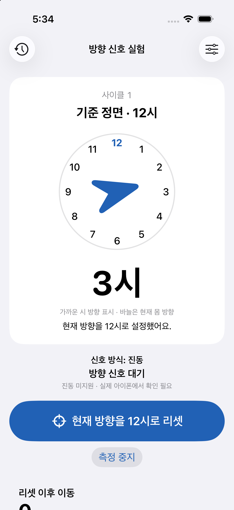
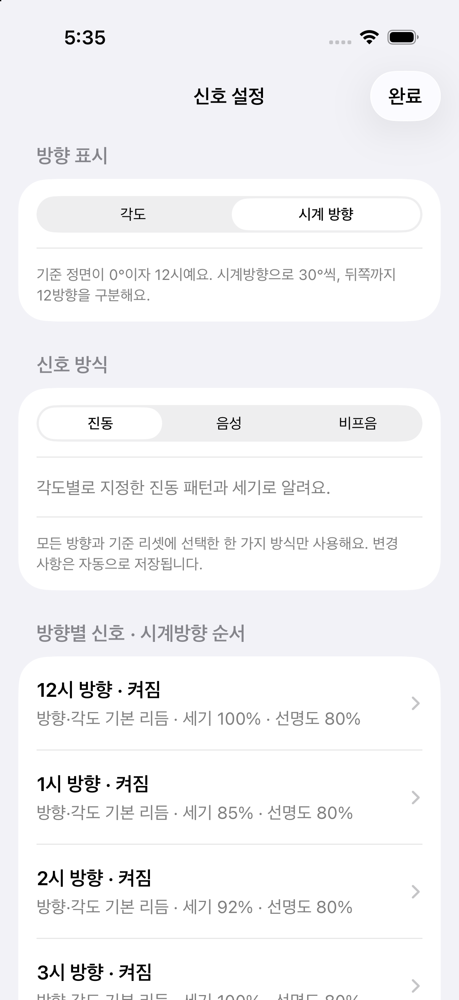

# OrientationHapticsLab

허리에 세로로 고정한 아이폰으로 **리셋한 방향에서 얼마나 회전했는지** 측정하고, 각도마다 진동·음성·비프음 중 선택한 신호를 보내는 실험 앱입니다. 개발 중인 앱은 [`develop`](https://github.com/wsysangyoung2730-debug/2026-C6-A13-OrientationHapticsLab/tree/develop)에서 확인하세요.

## 실행

1. `develop` 브랜치를 받고 `OrientationHapticsLab.xcodeproj`를 Xcode 26 이상에서 엽니다.
2. 앱 타깃의 Signing & Capabilities에서 자신의 Team을 선택합니다. 필요하면 Bundle Identifier를 자신의 고유 값으로 변경합니다.
3. iOS 26 이상 아이폰을 실행 대상으로 선택해 빌드합니다.
4. 동작 및 피트니스 접근을 허용합니다. 권한이 없어도 방향 측정은 사용할 수 있지만 걸음 수는 제공되지 않습니다.
5. 배 앞쪽 허리에 러닝 밴드로 세로 고정하고 **화면이 바깥쪽**을 향하도록 합니다.
6. 정면을 향한 뒤 **현재 방향을 0°로 리셋**을 누릅니다.

정확한 진동 체감과 센서 오차는 아이폰에서 검증해야 합니다. 시뮬레이터에서는 가상 방향과 화면·소리 신호를 체험할 수 있으며, 실제 진동·보행 검증 결과는 아닙니다.

## 주요 기능

- 중력 기준 수평면에서 기기의 화면 정면 방향을 구해 상대 회전각 표시
- 각도 표시는 기준 정면 0°에서 시계방향 0~359°, 시계 표시는 12시~11시와 현재 방향 바늘을 제공
- 정면·뒤쪽 포함 30° 간격의 12방향 진입/통과 시 선택한 신호, 경계 흔들림 중 중복 방지
- 신호 방식으로 진동·음성·비프음 중 하나를 선택하고 저장
- 각도별 사용 여부, 진동 패턴, 세기, 선명도를 설정하고 저장
- 선택한 신호 재생 동안 각도별 단색 전체 화면과 큰 방향·각도 표시
- 버튼 리셋 시 이전 사이클 로그 저장, 방향·걸음·추정 거리와 좌표 초기화
- 걸음 수, 추정 이동 거리, 초기 방향 기준 전방/오른쪽 좌표 표시
- 로그와 신호 이력 기기 내 저장 및 확인

## 12방향 표시와 햅틱

설정의 **방향 표시 → 각도 / 시계 방향**과 **신호 방식 → 음성 → 각도로 읽기 / 시계 방향으로 읽기**는 독립적입니다. 기준 정면은 리셋할 때 고정되며 몸을 돌린다고 자동으로 바뀌지 않습니다. 왼쪽 30°는 시계방향 330°이자 11시, 뒤쪽 180°는 6시입니다. 시계 숫자는 가장 가까운 30° 방향이고 바늘은 실시간 각도를 표시합니다. 알림은 숫자가 바뀔 때마다가 아니라 기준점 ±3° 진입/통과 시 발생하며 6°를 벗어나야 다시 울립니다.

방향별 진동 설정에는 기존 리듬 외에 **길이 조합**(짧게–짧게 / 길게–길게 / 길게–짧게 / 짧게–길게)과 **속도 변화**(빠른 3회 / 느린 3회 / 점점 빠르게 / 점점 느리게)를 추가했습니다. 방향별로 배정하고 세기·선명도를 조절해 체험할 수 있습니다. [DirectionHaptics](https://github.com/DeveloperAcademy-POSTECH/2026-C6-A13-Hear-I-am/blob/c39f25fe8d94eaa971d76ddfcbd189a4dcc44454/Prototype/DirectionHaptics/README.md)의 A·D 계열을 참고했으며, 속도 변화는 기존 엔진의 65ms 연속 진동을 사용해 원본 transient와 촉감이 같다고 보장하지 않습니다. 12방향 식별률은 아직 측정하지 않았습니다.

기존 ±45° 설정은 ±60°로 옮기며 ±30°·±90° 설정은 유지합니다. 이전 로그의 45° 기록은 바꾸지 않습니다. 표시·음성 표현·신호 패턴을 새 로그의 패턴 설명에 함께 기록합니다.

## 신호 방식 선택

설정 상단의 **진동 / 음성 / 비프음**에서 한 가지를 선택합니다. 모든 각도 도달, 각도별 체험 버튼, 기준 리셋 완료에 적용됩니다. 앱을 다시 열어도 선택을 유지하며, 기존 진동 패턴 설정도 보존합니다.

| 방식 | 각도 도달 | 리셋 완료 |
| --- | --- | --- |
| 진동 | 각도별로 저장한 패턴·세기·선명도 | 부드러운 긴 진동 두 번 |
| 음성 | 각도 표현(“왼쪽 30도”) / 시계 표현(“11시 방향”) 선택 | 선택한 표현으로 0도 / 12시 설정 안내 |
| 비프음 | 좌우 440/880Hz, 30~150°는 1~5회. 정면·뒤쪽은 660Hz 1/2회 | 660Hz의 긴 소리 한 번 |

소리 크기는 아이폰의 미디어 음량으로 조절합니다. 음량이 0이면 안내를 표시합니다. 무음 모드에서도 소리가 나며 연결된 이어폰이 있으면 현재 오디오 출력 경로를 사용합니다. 새로운 각도는 이전 신호를 중단하고 즉시 교체합니다. 앱 중단이나 이어폰 연결 해제 시 재생을 멈추며, 끝난 신호를 자동으로 다시 재생하지 않습니다.

세 방식 모두 재생 중 전체 화면 색상 신호를 표시합니다. 시뮬레이터에서는 음성·비프음 재생을 시도할 수 있지만 진동은 화면 미리보기만 제공합니다. 실제 출력 음량, 음성 가용성, 공연장 소음 속 식별 가능성은 아이폰에서 확인해야 합니다.

## 화면 예시

아래 이미지는 iOS 26.3 시뮬레이터에서 확인한 화면입니다. 전체 화면 신호는 화면 미리보기이며 실제 진동 측정 결과가 아닙니다.

 

## 동작 조건

- 1차 버전은 **앱을 전면에 열고 화면이 켜진 상태**에서 테스트합니다. 측정 중 자동 잠금을 막고 중지하면 원래 동작으로 복구합니다.
- 백그라운드 전환·방향 센서 끊김·수평 방향 계산이 불가능한 자세 이후에는 기준을 다시 설정합니다. 방향 기준만 무효화된 경우 걸음 집계는 계속됩니다.
- 권한 팝업처럼 잠시 화면이 비활성화되면 신호만 중단합니다. 백그라운드 전환이나 측정 중지는 사이클을 종료합니다.
- 머리의 시선이 아니라 **아이폰이 고정된 몸의 방향**을 측정합니다. 밴드 안에서 아이폰이 움직이면 오차가 생깁니다.
- 리셋은 화면 버튼만 지원합니다.
- 공간 크기 측정, GPS 위치, 장애물 감지, 워치·에어팟 연동은 포함하지 않습니다.

## 걸음과 좌표의 의미

걸음 수는 `CMPedometer`가 처리한 누적 자료입니다. 매 걸음 즉시 표시되는 것은 아니며 데이터가 늦게 도착할 수 있습니다. 좌표는 **몸이 향한 방향으로 앞으로 걸었다는 가정의 추정값**입니다. 옆걸음·뒷걸음은 구분하지 않습니다.

시스템 추정 거리를 받을 수 있으면 사용하고, 없으면 한 걸음 0.65m로 계산합니다. 한 사이클 안에서는 거리 계산 방식을 고정해 중복 합산을 피합니다. 지연된 걸음 자료는 해당 시간 구간의 방향 이력과 결합하며, 회전 구간이나 기록 누락 시 좌표 불확실성을 표시합니다. 이것은 실제 위치 좌표를 직접 측정하는 방식이 아닙니다.

## 개발 검증

```sh
swift test --package-path Packages/OrientationCore
xcodebuild -project OrientationHapticsLab.xcodeproj \
  -scheme OrientationHapticsLab -sdk iphonesimulator \
  -destination 'generic/platform=iOS Simulator' \
  CODE_SIGNING_ALLOWED=NO build
xcodebuild -project OrientationHapticsLab.xcodeproj \
  -scheme OrientationHapticsLab \
  -destination 'platform=iOS Simulator,name=iPhone 17 Pro' \
  CODE_SIGNING_ALLOWED=NO test
```

시뮬레이터 이름은 설치된 기기에 맞춰 바꿉니다.

터미널이 Command Line Tools를 선택한 Mac에서는 `DEVELOPER_DIR=/Applications/Xcode.app/Contents/Developer`를 설정하고 `xcrun swift`를 사용합니다.

- 계산 테스트: 착용 방향·기울기, 좌우 부호, ±180° 경계, 각도 진입/통과·재진입, 지연된 걸음 자료, 사이클 분리, 로그 직렬화
- 앱 테스트: 설정 저장·복원, 기존 설정 호환, 신호 전환·중단, 음성 문구·비프음 파일, 이전 로그 보정·보존, 진동 응답 지연·취소, 권한 팝업·방향 누락·반복 리셋, SDK 콜백 실행 영역 (35개)
- 자동 빌드: develop 대상 PR 및 develop 변경 시 GitHub Actions 실행
- 실기기 첫 실행 크래시: [원인과 콜백 실행 영역 수정](docs/startup-crash.md)
- 리셋·걸음 문제: [원인 분석과 개선·검증 기록](docs/reset-and-steps.md)
- 현장 검증: [착용 검증 절차](docs/field-validation.md)
- 브랜치와 커밋: [Git 작업 규칙](CONTRIBUTING.md)

## 12방향 구현 검증 (2026-10-08)

- 방향·보행 코어 검사 34개 통과, iOS 시뮬레이터 앱 검사 42개 통과.
- 시계 화면과 표시 방식 설정 화면을 iOS 26.3 시뮬레이터에서 캡처해 확인.
- 한 바퀴 양방향 회전, 정면/뒤쪽 중복 방지, 설정 이전, 음성 표현, 새 햅틱의 길이·간격, 리셋 직후 중복 신호 방지 및 기존 센서·보행·저장 기능 검사 포함.
- 실제 아이폰 착용 회전, VoiceOver 청취, 음량·이어폰 출력 및 햅틱 인지 성능은 현장 검증이 남아 있음. [실기기 절차](docs/field-validation.md).

## 이전 구현 검증 기록

2026-10-07 기준:

- 방향·각도·걸음 계산 테스트 30개 통과
- iOS 26.3 시뮬레이터에서 설정·로그 저장·신호 전환·리셋과 걸음 처리 테스트 35개 통과
- Xcode 27에서 iOS 26 최소 지원 설정으로 앱 빌드 성공
- 설정 목록과 전체 화면 신호의 실제 렌더링 확인
- 실제 아이폰의 허리 착용 오차, 진동 식별률, 보행 정확도는 **미측정**

## 구현 구조

```text
OrientationHapticsLab/
├── App/                       앱 시작점
├── Features/
│   ├── Orientation/           방향 센서·기준 리셋·실험 화면
│   ├── Walking/               걸음 센서·걸음과 좌표 화면
│   ├── Signals/               진동·음성·비프음 출력과 색상 신호
│   ├── Settings/              신호 설정 화면과 저장
│   └── Logs/                  사이클 로그 화면과 파일 저장
└── Resources/                 색상·이미지 리소스
OrientationHapticsLabTests/
├── Settings/                  설정 저장 테스트
├── Logs/                      로그 보존·보정 테스트
├── Signals/                   신호 선택·오디오 테스트
└── Integration/               리셋 반응·측정 생명주기 테스트
Packages/OrientationCore/
├── Sources/OrientationCore/
│   ├── Orientation/           방향 계산·각도 도달 감지
│   ├── Walking/               걸음과 좌표 추정
│   └── Sessions/              사이클 기록 모델
└── Tests/OrientationCoreTests/ 방향·걸음 계산 테스트
```

- `LabModel`은 실험 사이클을 관리하며 각 기능의 센서·신호·저장소를 연결합니다.
- 계산 모듈은 기기 API와 분리되어 있습니다. Xcode와 Swift Package는 하위 폴더의 소스를 자동으로 포함합니다.
- 센서의 측정 시각과 작업 세대를 검사해 오래된 콜백이 새 사이클을 변경하지 않도록 처리합니다.
- 진동 장치 준비, 보행 센서 호출, 로그 파일 저장은 UI 스레드와 분리합니다.
- 로그의 신호 이력은 앱에 접수된 요청이며 실제 출력이나 체감을 보장하지 않습니다.

## 참고

[OrientationCoreMotionTest](https://github.com/na0k1m/OrientationCoreMotionTest)의 상대 방향 리셋과 각도에 따른 진동 실험 구조를 참고했습니다. 새 앱은 세로 착용 좌표계, 각도별 사용자 설정, 보행 기록을 위한 별도 구현입니다.

- [Apple: 처리된 기기 동작 데이터](https://developer.apple.com/documentation/coremotion/getting-processed-device-motion-data)
- [Apple: Core Haptics](https://developer.apple.com/documentation/corehaptics)
- [Apple: CMPedometer](https://developer.apple.com/documentation/coremotion/cmpedometer)

- [Apple: AVSpeechSynthesizer](https://developer.apple.com/documentation/avfaudio/avspeechsynthesizer)
- [Apple: 오디오 중단 처리](https://developer.apple.com/documentation/avfaudio/handling-audio-interruptions)
